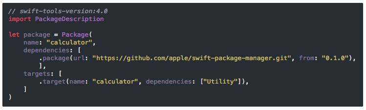

# fruits-eneko
This is my personal Xcode theme, based in [Fruits](https://github.com/muukii/xcode-fruits) and improved over the years using it.


## Features
- ✅ Differentiate between classes and other type definitions.
- ✅ Differentiate between types defined in current vs. other modules.
- ✅ Differentiate between plain comments and documentation markup.

## Installation

### From the Terminal
1. Run the following command:
```
curl -o ~/Library/Developer/Xcode/UserData/FontAndColorThemes/fruits-eneko.xccolortheme https://raw.githubusercontent.com/eneko/fruits-eneko/master/fruits-eneko.xccolortheme
```
2. Restart Xcode

### Manually
1. [Download the theme](https://raw.githubusercontent.com/eneko/fruits-eneko/master/fruits-eneko.xccolortheme) and save it to `~/Library/Developer/Xcode/UserData/FontAndColorThemes/`
2. Restart Xcode

## Xcode Theme Configuration
- SF Mono Regular 13
- Normal spacing
- Background #1C1F26
- Current Line #53555A alpha 0.79
- Block Cursor #66CCFF
- Invisibles #6BECFE

## Theme In Use


## BONUS: Jekyll Syntax Highlighter Theme for GitHub Pages

Back in January I ported my Xcode theme so I could use it on my personal
website for syntax highlighting.

Requirements:
- Jekyll (with our without GitHub Pages)
- Rouge / Pigment (default syntaxhighlighter for Jekyll)



You can [see the theme in action here](https://www.enekoalonso.com/articles/handling-commands-with-swift-package-manager).

### Installation on Jekyll / GitHub Pages

1. [Download the SCSS file](https://raw.githubusercontent.com/eneko/fruits-eneko/master/_fruits-eneko.scss) and save it to your project `/_sass` folder
2. In your `main.scss` file, import the theme:

```
// Import partials from `sass_dir` (defaults to `_sass`)
@import
        "base",
        "layout",
        "fruits-eneko"
;
```
